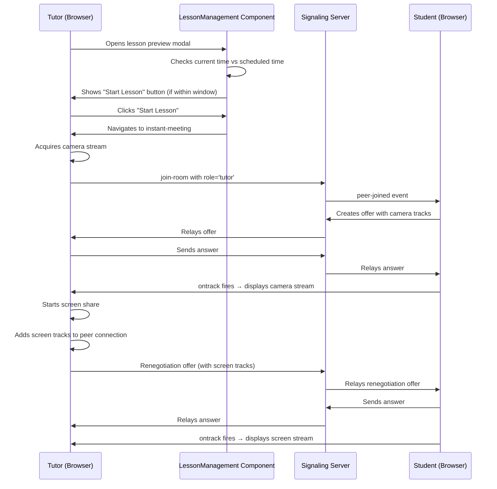

# Design Document: Online Lesson Start Button and WebRTC Video Sharing Fix

## Overview

This design addresses two critical issues in the online lesson system: enabling tutors to start lessons early (up to 15 minutes before scheduled time) and fixing bidirectional WebRTC video streaming problems. Currently, the lesson preview modal lacks a "Start Lesson" button, and WebRTC media streams fail to properly display due to incorrect track handling and signaling issues.

The solution involves:
1. Adding time-aware UI controls in the lesson management component
2. Fixing WebRTC ontrack handlers to properly distinguish camera vs screen share streams
3. Ensuring proper SDP renegotiation when media streams are added/removed
4. Implementing robust signaling message propagation

### Key Design Decisions

**Time-Based Button Availability**: The start button will use client-side time calculations with a 15-minute early start window. This avoids server polling and provides immediate UI feedback.

**Stream Identification Strategy**: Rather than relying on the `isScreenSharing` flag (which isn't set when ontrack fires), we'll use track metadata and stream track counts to distinguish camera feeds from screen shares. Screen shares typically have only video tracks, while camera streams have both audio and video.

**Signaling Architecture**: The existing Socket.IO signaling server will be enhanced to properly handle renegotiation offers and ensure all media state changes trigger appropriate signaling messages.

## Architecture

### Component Interaction Flow



### System Components

**Frontend Components**:
- `lesson-management.component.ts`: Displays lesson preview modal with time-aware start button
- `instant-meeting.component.ts`: Tutor meeting interface with WebRTC peer connections
- `meeting-join.component.ts`: Student meeting interface with WebRTC peer connections

**Backend Services**:
- `OnlineLessonService`: Manages lesson time assignments and session data
- `OnlineLessonController`: REST API for lesson operations
- WebRTC Signaling Server (Node.js): Handles Socket.IO signaling for WebRTC

**Database Entities**:
- `LessonTimeAssignment`: Stores day/time assignments for online lessons
- `LessonSession`: Tracks individual lesson session instances

## Components and Interfaces

### Frontend Component Changes

#### LessonManagementComponent

**New Methods**:
```typescript
canStartLesson(assignment: LessonTimeAssignment): boolean
getTimeUntilEarlyStart(assignment: LessonTimeAssignment): string
isWithinLessonWindow(assignment: LessonTimeAssignment): boolean
```

**Logic**:
- `canStartLesson()`: Returns true if current time is within 15 minutes before start time and before end time, on the correct day of week
- `getTimeUntilEarlyStart()`: Calculates and formats the time remaining until the early start window opens
- `isWithinLessonWindow()`: Checks if current time is between (startTime - 15 minutes) and endTime

#### InstantMeetingComponent & MeetingJoinComponent

**Modified Methods**:
```typescript
// Enhanced ontrack handler
pc.ontrack = (event) => {
  const stream = event.streams[0];
  if (!stream) return;
  
  // Identify stream type by track count and kind
  const videoTracks = stream.getVideoTracks();
  const audioTracks = stream.getAudioTracks();
  
  // Screen shares typically have only video, no audio
  if (videoTracks.length > 0 && audioTracks.length === 0) {
    participant.screenStream = stream;
    participant.isScreenSharing = true;
  } else if (videoTracks.length > 0) {
    // Camera stream (has video, may have audio)
    participant.cameraStream = stream;
    participant.isCameraOff = false;
  } else if (audioTracks.length > 0) {
    // Audio-only track, attach to camera stream
    if (!participant.cameraStream) {
      participant.cameraStream = stream;
    }
  }
}
```

**Renegotiation Handling**:
```typescript
pc.onnegotiationneeded = async () => {
  try {
    const offer = await pc.createOffer();
    await pc.setLocalDescription(offer);
    this.socket.emit('offer', { 
      to: socketId, 
      offer, 
      from: this.socket.id, 
      fromName: this.userName,
      isRenegotiation: true 
    });
  } catch (e) {
    console.error('Renegotiation failed', e);
  }
}
```

### Backend API Interfaces

No changes required to backend APIs. Existing endpoints support the functionality:
- `GET /online-lessons/{lessonId}/time-assignment`: Returns time assignment for lesson
- `POST /online-lessons/{lessonId}/assign-time-slot`: Assigns time slot to lesson

### WebRTC Signaling Protocol

**Enhanced Signaling Messages**:

```typescript
// Offer message (handles both initial and renegotiation)
{
  to: string,           // Target socket ID
  from: string,         // Sender socket ID
  fromName: string,     // Sender display name
  offer: RTCSessionDescriptionInit,
  isRenegotiation?: boolean  // Flag for renegotiation offers
}

// Media state broadcast
{
  roomId: string,
  socketId: string,     // Sender socket ID
  audio: boolean,       // Mic enabled
  video: boolean,       // Camera enabled
  screen: boolean       // Screen sharing active
}
```

## Data Models

### LessonTimeAssignment Entity

```java
@Entity
public class LessonTimeAssignment {
    @Id
    @GeneratedValue(strategy = GenerationType.IDENTITY)
    private Long id;
    
    @ManyToOne
    @JoinColumn(name = "lesson_id")
    private Lesson lesson;
    
    private Long tutorId;
    
    @Enumerated(EnumType.STRING)
    private DayOfWeek dayOfWeek;  // MONDAY, TUESDAY, etc.
    
    private LocalTime startTime;  // e.g., "14:00"
    private LocalTime endTime;    // e.g., "15:00"
}
```

### Participant Interface (Frontend)

```typescript
interface Participant {
  socketId: string;
  name: string;
  role: 'tutor' | 'student';
  cameraStream: MediaStream | null;
  screenStream: MediaStream | null;
  isMicMuted: boolean;
  isCameraOff: boolean;
  isScreenSharing: boolean;
  connection: RTCPeerConnection | null;
}
```

### Stream Identification Logic

**Decision Tree for ontrack Handler**:
1. Check if stream has video tracks
2. Check if stream has audio tracks
3. If video only → Screen share stream
4. If video + audio → Camera stream
5. If audio only → Attach to existing camera stream or create new

This approach is more reliable than checking the `isScreenSharing` flag because:
- The flag is set asynchronously after the stream is created
- ontrack fires immediately when tracks arrive
- Screen capture APIs (`getDisplayMedia`) produce video-only streams by default
- User cameras (`getUserMedia`) produce audio+video streams

## Correctness Properties

*A property is a characteristic or behavior that should hold true across all valid executions of a system—essentially, a formal statement about what the system should do. Properties serve as the bridge between human-readable specifications and machine-verifiable correctness guarantees.*

### Property 1: Early Start Window Button Availability

*For any* online lesson with a scheduled start time and end time, the Start Lesson button should be enabled if and only if the current time is within the window from 15 minutes before the scheduled start time until the scheduled end time, and the current day matches the lesson's assigned day of week.

**Validates: Requirements 1.1, 2.1**

### Property 2: Time Until Early Start Calculation

*For any* online lesson with a scheduled start time, when the current time is before the early start window, the system should calculate and display the time remaining until the window opens with accuracy within 1 minute.

**Validates: Requirements 1.4**

### Property 3: Lesson Initiation During Valid Window

*For any* online lesson, when the Start Lesson button is clicked during the valid availability window (15 minutes before start time to end time), the system should initiate a WebRTC session and navigate to the meeting interface.

**Validates: Requirements 1.3**

### Property 4: Bidirectional Media Stream Transmission

*For any* WebRTC session with connected participants, when any participant (tutor or student) enables a media stream (camera or screen share), all other connected participants should receive that stream through their peer connections.

**Validates: Requirements 3.1, 4.1, 5.1**

### Property 5: Media Stream Error Handling

*For any* media stream transmission failure (camera, screen share, or audio), the system should log the error with relevant context and display an appropriate status message or placeholder to affected participants.

**Validates: Requirements 3.3, 4.5, 5.5**

### Property 6: Stream Removal Synchronization

*For any* active media stream (camera or screen share), when the stream is stopped or disabled by the sender, all receiving participants should have their UI updated to reflect the stream removal.

**Validates: Requirements 4.4, 5.4**

### Property 7: Multiple Student Camera Display

*For any* WebRTC session with multiple students, when students enable their camera feeds, the tutor's interface should display all active student camera streams simultaneously in the UI.

**Validates: Requirements 5.3**

### Property 8: Peer Connection Establishment

*For any* participant joining a WebRTC session with existing participants, the signaling server should facilitate the establishment of peer connections between the new participant and all existing participants through offer/answer exchange.

**Validates: Requirements 6.1**

### Property 9: Media State Change Propagation

*For any* media stream addition or removal event, the signaling server should propagate the corresponding signaling messages (offers, answers, ICE candidates) to all relevant peer connections.

**Validates: Requirements 6.2**

### Property 10: Signaling Message Retry

*For any* signaling message that fails to deliver, the signaling server should retry transmission up to 3 times with exponential backoff before marking the delivery as failed.

**Validates: Requirements 6.3**

### Property 11: Connection Event Logging

*For any* WebRTC connection establishment event or failure, the signaling server should create a log entry containing the event type, participant identifiers, timestamp, and relevant error information if applicable.

**Validates: Requirements 6.4**

### Property 12: Automatic Reconnection

*For any* peer connection that enters a failed state, the system should automatically attempt to re-establish the connection by restarting ICE negotiation.

**Validates: Requirements 6.5**

### Property 13: SDP Offer/Answer Round Trip

*For any* media track addition (camera or screen share), the system should create an SDP offer including the track, transmit it to the peer, receive an SDP answer, and successfully establish the media channel.

**Validates: Requirements 7.1, 7.2**

### Property 14: ICE Candidate Exchange

*For any* peer connection being established, both peers should exchange ICE candidates bidirectionally until an optimal connection path is found or all candidates are exhausted.

**Validates: Requirements 7.3**

### Property 15: Renegotiation on Media Changes

*For any* existing peer connection, when media tracks are added or removed, the system should trigger renegotiation by creating and exchanging updated SDP offers and answers.

**Validates: Requirements 7.4**

### Property 16: Multiple Track Handling

*For any* peer connection, the system should support multiple simultaneous media tracks (e.g., camera video, camera audio, screen share video) within a single connection without requiring separate connections per track.

**Validates: Requirements 7.5**

### Property 17: Stream Type Identification

*For any* incoming media stream in the ontrack handler, the system should correctly identify whether it is a camera stream or screen share stream based on the track composition (video+audio vs video-only), and assign it to the appropriate stream property.

**Validates: Requirements 3.1, 4.1** (implicit requirement for correct stream handling)

## Error Handling

### Time Calculation Errors

**Scenario**: System clock is incorrect or timezone mismatches occur

**Handling**:
- Use browser's local time consistently across all calculations
- Display timezone information alongside lesson times
- Log warnings if calculated times produce unexpected results (e.g., negative durations)

### WebRTC Connection Failures

**Scenario**: Peer connection fails to establish or drops during session

**Handling**:
- Implement automatic ICE restart on connection failure (already in design)
- Display connection status indicators to users
- Log detailed error information including ICE connection state, gathering state, and signaling state
- Provide manual "Reconnect" button if automatic reconnection fails after 3 attempts

### Media Stream Acquisition Failures

**Scenario**: User denies camera/microphone permissions or devices are unavailable

**Handling**:
- Catch getUserMedia/getDisplayMedia exceptions
- Display user-friendly error messages explaining the issue
- Allow users to join with audio-only or as observers if video fails
- Provide instructions for granting permissions in browser settings

### Signaling Server Disconnection

**Scenario**: WebSocket connection to signaling server is lost

**Handling**:
- Detect disconnection via Socket.IO disconnect event
- Attempt automatic reconnection with exponential backoff (Socket.IO handles this)
- Display "Reconnecting..." status to user
- If reconnection fails after 30 seconds, prompt user to refresh the page
- Preserve local media streams during reconnection attempts

### SDP Negotiation Failures

**Scenario**: Offer/answer exchange fails or produces incompatible SDP

**Handling**:
- Wrap all setLocalDescription/setRemoteDescription calls in try-catch
- Log the full SDP content on failure for debugging
- Retry negotiation once if initial attempt fails
- Display error message to user if negotiation fails after retry
- Provide "Restart Connection" option to recreate peer connection from scratch

### Stream Identification Ambiguity

**Scenario**: Incoming stream has unexpected track composition

**Handling**:
- Default to treating ambiguous streams as camera streams
- Log warning with stream details for debugging
- Allow manual stream type override in UI if misidentified
- Monitor track additions/removals to update stream type if needed

## Testing Strategy

### Dual Testing Approach

This feature requires both unit tests and property-based tests for comprehensive coverage:

**Unit Tests** focus on:
- Specific time boundary examples (exactly 15 minutes before, at start time, at end time)
- Edge cases like midnight crossings and daylight saving time transitions
- Integration points between components (button click → navigation)
- Error conditions with specific error types
- UI rendering with specific participant counts

**Property-Based Tests** focus on:
- Time calculations across random lesson schedules and current times
- WebRTC stream handling across random participant configurations
- Signaling message propagation with random network conditions
- SDP negotiation with random media track combinations

### Property-Based Testing Configuration

**Framework**: fast-check (JavaScript/TypeScript property-based testing library)

**Test Configuration**:
- Minimum 100 iterations per property test
- Each test tagged with format: **Feature: online-lesson-start-and-video-fix, Property {number}: {property_text}**

**Example Property Test Structure**:

```typescript
import fc from 'fast-check';

describe('Feature: online-lesson-start-and-video-fix, Property 1: Early Start Window Button Availability', () => {
  it('should enable button only within 15-minute early start window', () => {
    fc.assert(
      fc.property(
        fc.record({
          scheduledStartTime: fc.date(),
          scheduledEndTime: fc.date(),
          currentTime: fc.date(),
          dayOfWeek: fc.integer({ min: 0, max: 6 })
        }),
        ({ scheduledStartTime, scheduledEndTime, currentTime, dayOfWeek }) => {
          const earlyStartTime = new Date(scheduledStartTime.getTime() - 15 * 60 * 1000);
          const expectedEnabled = 
            currentTime >= earlyStartTime && 
            currentTime <= scheduledEndTime &&
            currentTime.getDay() === dayOfWeek;
          
          const actualEnabled = canStartLesson(scheduledStartTime, scheduledEndTime, currentTime, dayOfWeek);
          
          return actualEnabled === expectedEnabled;
        }
      ),
      { numRuns: 100 }
    );
  });
});
```

### Unit Test Coverage Areas

**Time-Based Button Logic**:
- Test at exactly 15 minutes before start time
- Test at 16 minutes before (should be disabled)
- Test at 14 minutes before (should be enabled)
- Test at scheduled start time
- Test at scheduled end time
- Test 1 minute after end time (should be disabled)
- Test on wrong day of week (should be disabled)

**WebRTC Stream Handling**:
- Test ontrack with video+audio stream (should identify as camera)
- Test ontrack with video-only stream (should identify as screen share)
- Test ontrack with audio-only stream (should attach to camera)
- Test multiple tracks arriving in sequence
- Test track removal and stream cleanup

**Signaling Message Flow**:
- Test offer/answer exchange for initial connection
- Test offer/answer exchange for renegotiation
- Test ICE candidate exchange
- Test media state broadcast
- Test participant join/leave events

**Error Scenarios**:
- Test getUserMedia failure (permissions denied)
- Test getDisplayMedia failure (user cancelled)
- Test peer connection failure (network issue)
- Test signaling server disconnection
- Test SDP negotiation failure

### Integration Testing

**End-to-End Scenarios**:
1. Tutor starts lesson early → Student joins → Both see each other's cameras
2. Tutor shares screen → Student sees screen share → Tutor stops sharing → Student view updates
3. Multiple students join → Tutor sees all student cameras in grid
4. Connection drops → Automatic reconnection succeeds → Streams resume
5. Tutor leaves → All students receive notification and are disconnected

**Testing Tools**:
- Playwright or Cypress for browser automation
- Mock WebRTC peer connections for controlled testing
- Mock signaling server for testing client-side logic in isolation

### Performance Testing

**Metrics to Measure**:
- Time from button click to WebRTC session start (target: < 2 seconds)
- Time from stream addition to ontrack firing (target: < 3 seconds)
- Time from stream removal to UI update (target: < 2 seconds)
- Signaling message latency (target: < 500ms)
- Memory usage with 10+ participants (target: < 500MB)

**Load Testing**:
- Test with 1, 5, 10, 20 participants
- Measure CPU usage during active video streaming
- Test network bandwidth requirements
- Verify graceful degradation under poor network conditions

