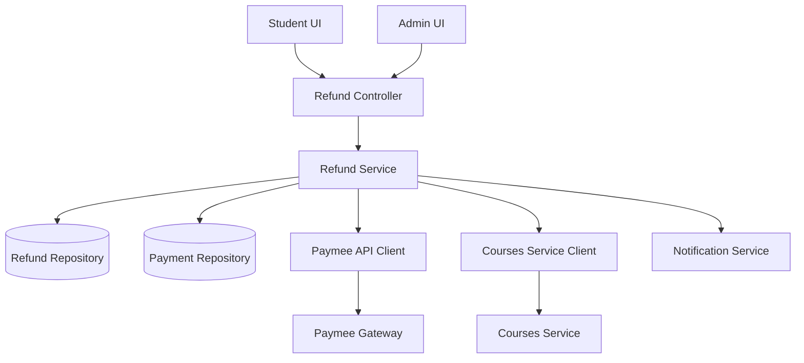
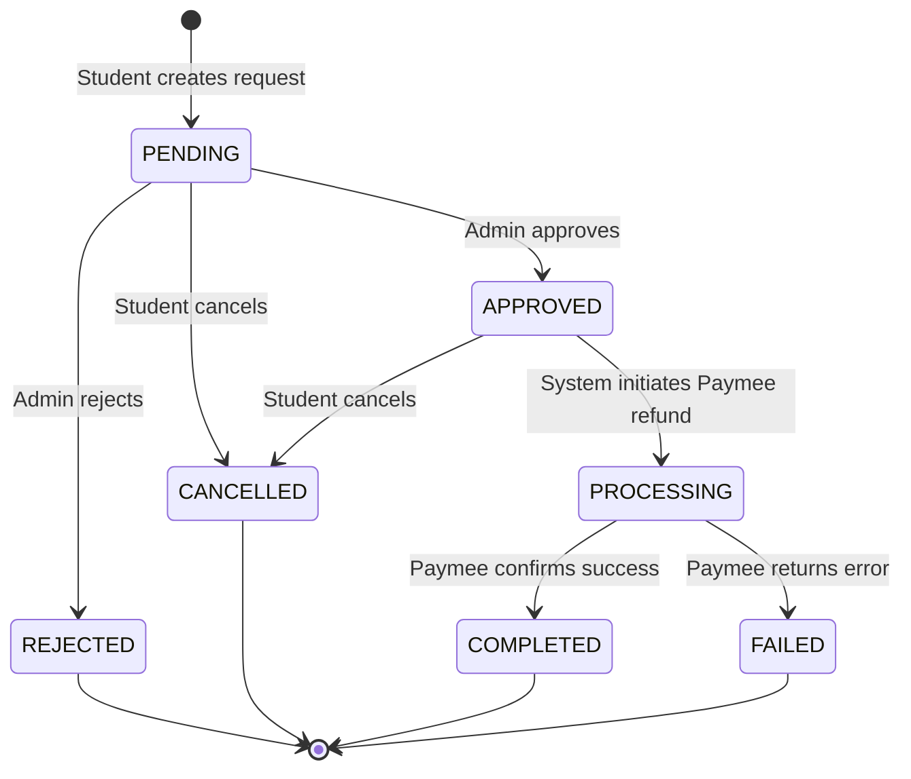
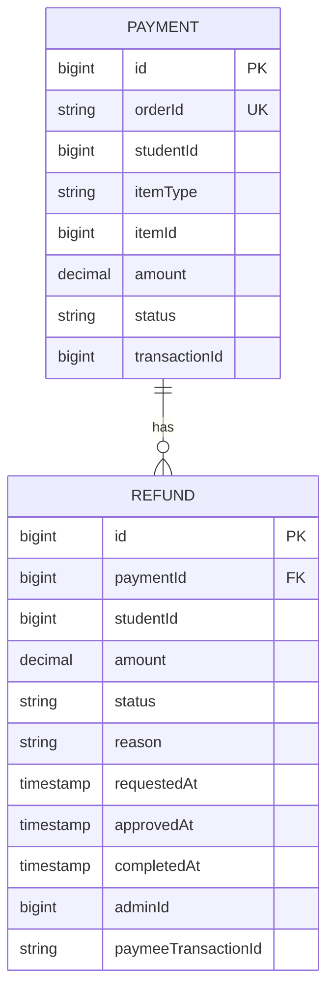

# Design Document: Payment Refund System

## Overview

The Payment Refund System extends the existing payment-service microservice to handle refund requests, approvals, processing, and enrollment reversal. The system integrates with the Paymee payment gateway for actual refund processing and coordinates with the courses-service for enrollment management.

### Key Design Goals

- Enable students to request refunds for courses and packs within eligibility windows
- Provide administrators with tools to review and process refund requests
- Automate refund processing through Paymee gateway integration
- Ensure enrollment reversal when refunds are completed
- Maintain comprehensive audit trails for financial compliance
- Support both course and pack refund scenarios

### System Context

The refund system operates within the existing microservices architecture:
- **Payment Service**: Hosts the refund subsystem, manages payment and refund data
- **Courses Service**: Provides enrollment management APIs for reversal operations
- **Auth Service**: Provides user authentication and authorization
- **Frontend**: Angular components for student and admin interfaces
- **Paymee Gateway**: External payment processor for refund transactions

## Architecture

### High-Level Architecture



### Component Responsibilities

**RefundController**
- Exposes REST endpoints for refund operations
- Handles request validation and authentication
- Maps between DTOs and service layer
- Enforces role-based access control

**RefundService**
- Core business logic for refund lifecycle
- Eligibility validation (time window, progress thresholds)
- State machine management for refund status transitions
- Orchestrates external service calls (Paymee, Courses, Notifications)
- Transaction management and error handling

**RefundRepository**
- Data access layer for refund entities
- Custom queries for filtering and statistics
- Audit trail queries

**PaymeeClient**
- Integration with Paymee refund API
- Request/response mapping
- Error handling and retry logic

**CoursesServiceClient**
- Integration with courses-service enrollment APIs
- Handles both course and pack unenrollment
- Error handling for enrollment reversal failures

**NotificationService**
- Email notifications for refund lifecycle events
- Template-based email generation
- Asynchronous notification delivery

### Refund State Machine



### Status Transition Rules

| From Status | To Status | Trigger | Authorization |
|------------|-----------|---------|---------------|
| - | PENDING | Student creates request | Student (own payments) |
| PENDING | APPROVED | Admin approves | Admin only |
| PENDING | REJECTED | Admin rejects | Admin only |
| PENDING | CANCELLED | Student cancels | Student (own requests) |
| APPROVED | PROCESSING | System processes | System automatic |
| APPROVED | CANCELLED | Student cancels | Student (own requests) |
| PROCESSING | COMPLETED | Paymee success | System automatic |
| PROCESSING | FAILED | Paymee error | System automatic |

## Components and Interfaces

### Backend Components

#### 1. Refund Entity

```java
@Entity
@Table(name = "refunds")
public class Refund {
    @Id
    @GeneratedValue(strategy = GenerationType.IDENTITY)
    private Long id;
    
    @ManyToOne(fetch = FetchType.LAZY)
    @JoinColumn(name = "payment_id", nullable = false)
    private Payment payment;
    
    @Column(nullable = false)
    private Long studentId;
    
    @Column(nullable = false, precision = 10, scale = 2)
    private BigDecimal amount;
    
    @Enumerated(EnumType.STRING)
    @Column(nullable = false)
    private RefundStatus status;
    
    @Column(length = 1000)
    private String reason;
    
    @Column(nullable = false)
    private LocalDateTime requestedAt;
    
    @Column
    private LocalDateTime approvedAt;
    
    @Column
    private LocalDateTime rejectedAt;
    
    @Column
    private LocalDateTime processingAt;
    
    @Column
    private LocalDateTime completedAt;
    
    @Column
    private LocalDateTime cancelledAt;
    
    @Column
    private Long adminId;
    
    @Column(length = 1000)
    private String rejectionReason;
    
    @Column
    private String paymeeTransactionId;
    
    @Column(length = 2000)
    private String errorMessage;
    
    @Column(nullable = false)
    private LocalDateTime createdAt;
    
    @Column(nullable = false)
    private LocalDateTime updatedAt;
}
```

#### 2. RefundStatus Enum

```java
public enum RefundStatus {
    PENDING,      // Initial state after student request
    APPROVED,     // Admin approved, awaiting processing
    REJECTED,     // Admin rejected
    PROCESSING,   // Being processed with Paymee
    COMPLETED,    // Successfully refunded
    FAILED,       // Paymee processing failed
    CANCELLED     // Cancelled by student
}
```

#### 3. RefundService Interface

```java
public interface RefundService {
    // Creation and validation
    RefundDTO createRefundRequest(CreateRefundRequest request, Long studentId);
    void validateRefundEligibility(Long paymentId, Long studentId);
    
    // Admin operations
    RefundDTO approveRefund(Long refundId, Long adminId);
    RefundDTO rejectRefund(Long refundId, Long adminId, String reason);
    
    // Processing
    RefundDTO processRefund(Long refundId);
    void handlePaymeeCallback(PaymeeRefundResponse response);
    
    // Student operations
    RefundDTO cancelRefund(Long refundId, Long studentId);
    
    // Queries
    RefundDTO getRefundById(Long refundId);
    List<RefundDTO> getRefundsByStudent(Long studentId);
    List<RefundDTO> getAllRefunds(RefundFilterDTO filter);
    RefundStatsDTO getRefundStatistics();
    
    // Internal operations
    void reverseEnrollment(Refund refund);
}
```

#### 4. REST API Endpoints

**Student Endpoints**
```
POST   /api/refunds                    - Create refund request
GET    /api/refunds/my-refunds         - Get student's refund history
GET    /api/refunds/{id}               - Get refund details
DELETE /api/refunds/{id}/cancel        - Cancel refund request
```

**Admin Endpoints**
```
GET    /api/refunds                    - Get all refunds (with filters)
GET    /api/refunds/{id}               - Get refund details
PUT    /api/refunds/{id}/approve       - Approve refund
PUT    /api/refunds/{id}/reject        - Reject refund
POST   /api/refunds/{id}/process       - Manually trigger processing
GET    /api/refunds/statistics         - Get refund statistics
```

**System Endpoints**
```
POST   /api/refunds/paymee-callback    - Paymee webhook for refund status
```

#### 5. DTOs

**CreateRefundRequest**
```java
public class CreateRefundRequest {
    private Long paymentId;
    private String reason;
}
```

**RefundDTO**
```java
public class RefundDTO {
    private Long id;
    private Long paymentId;
    private String orderId;
    private Long studentId;
    private String studentName;
    private String studentEmail;
    private String itemType;
    private Long itemId;
    private String itemName;
    private BigDecimal amount;
    private RefundStatus status;
    private String reason;
    private LocalDateTime requestedAt;
    private LocalDateTime approvedAt;
    private LocalDateTime rejectedAt;
    private LocalDateTime completedAt;
    private LocalDateTime cancelledAt;
    private Long adminId;
    private String rejectionReason;
    private String paymeeTransactionId;
    private String errorMessage;
}
```

**RefundFilterDTO**
```java
public class RefundFilterDTO {
    private RefundStatus status;
    private Long studentId;
    private LocalDate startDate;
    private LocalDate endDate;
    private String itemType;
}
```

**RefundStatsDTO**
```java
public class RefundStatsDTO {
    private Long totalRefunds;
    private Long pendingRefunds;
    private Long approvedRefunds;
    private Long completedRefunds;
    private Long rejectedRefunds;
    private Long failedRefunds;
    private BigDecimal totalRefundAmount;
    private BigDecimal completedRefundAmount;
}
```

#### 6. Paymee Integration

**Paymee Refund Request**
```java
public class PaymeeRefundRequest {
    private BigDecimal amount;
    private String transaction_id;  // Original payment transaction ID
}
```

**Paymee Refund Response**
```java
public class PaymeeRefundResponse {
    private Boolean status;
    private String message;
    private Integer code;
    private PaymeeRefundData data;
}

public class PaymeeRefundData {
    private String refund_transaction_id;
    private String status;
    private BigDecimal amount;
}
```

**API Configuration**
- Sandbox: `https://sandbox.paymee.tn/api/v2/payments/refund`
- Production: `https://app.paymee.tn/api/v2/payments/refund`
- Headers: `Authorization: Token {api_key}`, `Content-Type: application/json`

#### 7. Courses Service Integration

**Unenrollment Endpoints**
```
DELETE /enrollments/unenroll?studentId={studentId}&courseId={courseId}
DELETE /pack-enrollments/unenroll?studentId={studentId}&packId={packId}
```

### Frontend Components

#### 1. Student Refund Request Component

**Location**: `frontend/src/app/pages/student-panel/refund-request/`

**Features**:
- Display eligible payments for refund
- Show eligibility status (time remaining, progress)
- Refund request form with reason input
- Confirmation dialog

**Key Methods**:
```typescript
loadEligiblePayments(): void
checkEligibility(paymentId: number): Observable<EligibilityResponse>
submitRefundRequest(request: CreateRefundRequest): void
```

#### 2. Student Refund History Component

**Location**: `frontend/src/app/pages/student-panel/refund-history/`

**Features**:
- List all refund requests with status
- Filter by status
- View refund details
- Cancel pending/approved refunds

**Key Methods**:
```typescript
loadRefundHistory(): void
viewRefundDetails(refundId: number): void
cancelRefund(refundId: number): void
```

#### 3. Admin Refund Management Component

**Location**: `frontend/src/app/pages/admin-panel/refund-management/`

**Features**:
- List all refund requests with filters
- Sort by date, amount, status
- View detailed refund information
- Approve/reject actions with reason input
- View payment and enrollment history
- Display refund statistics dashboard

**Key Methods**:
```typescript
loadRefunds(filter: RefundFilter): void
approveRefund(refundId: number): void
rejectRefund(refundId: number, reason: string): void
viewPaymentDetails(paymentId: number): void
loadStatistics(): void
```

#### 4. Refund Service (Frontend)

**Location**: `frontend/src/app/core/services/refund.service.ts`

```typescript
@Injectable({ providedIn: 'root' })
export class RefundService {
  createRefundRequest(request: CreateRefundRequest): Observable<RefundDTO>
  getMyRefunds(): Observable<RefundDTO[]>
  getRefundById(id: number): Observable<RefundDTO>
  cancelRefund(id: number): Observable<void>
  
  // Admin methods
  getAllRefunds(filter?: RefundFilter): Observable<RefundDTO[]>
  approveRefund(id: number): Observable<RefundDTO>
  rejectRefund(id: number, reason: string): Observable<RefundDTO>
  getStatistics(): Observable<RefundStatsDTO>
}
```

## Data Models

### Database Schema

```sql
CREATE TABLE refunds (
    id BIGSERIAL PRIMARY KEY,
    payment_id BIGINT NOT NULL REFERENCES payments(id),
    student_id BIGINT NOT NULL,
    amount DECIMAL(10, 2) NOT NULL,
    status VARCHAR(20) NOT NULL,
    reason TEXT,
    requested_at TIMESTAMP NOT NULL,
    approved_at TIMESTAMP,
    rejected_at TIMESTAMP,
    processing_at TIMESTAMP,
    completed_at TIMESTAMP,
    cancelled_at TIMESTAMP,
    admin_id BIGINT,
    rejection_reason TEXT,
    paymee_transaction_id VARCHAR(255),
    error_message TEXT,
    created_at TIMESTAMP NOT NULL DEFAULT CURRENT_TIMESTAMP,
    updated_at TIMESTAMP NOT NULL DEFAULT CURRENT_TIMESTAMP,
    
    CONSTRAINT fk_refund_payment FOREIGN KEY (payment_id) REFERENCES payments(id),
    CONSTRAINT chk_refund_status CHECK (status IN ('PENDING', 'APPROVED', 'REJECTED', 'PROCESSING', 'COMPLETED', 'FAILED', 'CANCELLED'))
);

CREATE INDEX idx_refunds_payment_id ON refunds(payment_id);
CREATE INDEX idx_refunds_student_id ON refunds(student_id);
CREATE INDEX idx_refunds_status ON refunds(status);
CREATE INDEX idx_refunds_requested_at ON refunds(requested_at);
```

### Entity Relationships



### Data Constraints

- One payment can have multiple refund requests (but only one COMPLETED)
- Refund amount must not exceed payment received amount
- Student ID in refund must match payment student ID
- Payment must have status SUCCESS to be refundable
- Refund status transitions must follow state machine rules

